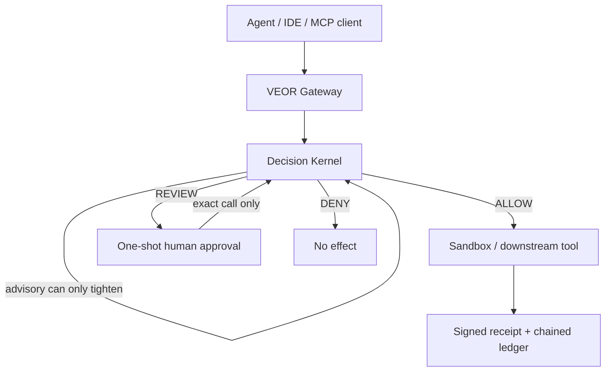

# VEOR

**A governed execution boundary for AI agents.** Models may propose tool calls; VEOR decides what may run, and records what did.

```text
Proposal → Reflex → Escalation → Authority → Effect → Proof
```



## The problem

Agent stacks often collapse judgment, permission, and side effects into one LLM call. That makes “the model said so” indistinguishable from “this was authorized,” and leaves little durable evidence when something goes wrong.

## What VEOR guarantees (in this preview)

When a call is routed through VEOR:

- **Deterministic policy first** — `ALLOW < REVIEW < DENY`; unknown MCP tools fail closed under the default bundle.
- **Monotonic advisory** — a reflex/advisory provider may only *tighten* via `max(severity, advisory)`. It cannot manufacture authority or weaken a deterministic `REVIEW`/`DENY`.
- **One-shot approvals** — human `REVIEW` → `ALLOW` is Ed25519-signed, bound to exact tool + argument digest + scope + expiry, and consumed once.
- **Receipts** — successful gateway effects can emit a separately signed execution receipt (distinct key from approval authority).
- **Sandbox honesty** — receipts/backends report the isolation actually used. Process fallback is `osEnforced: false`; it is never labelled as OS isolation.

## What VEOR does **not** guarantee

Read `docs/THREAT_MODEL.md` and `docs/SECURITY_MATRIX.md` before citing this project.

- Not a security certification or “production-safe” claim (`LAUNCH.md`, `SECURITY.md`).
- External security review: **PENDING** (`DEV_EVIDENCE.md`).
- Same-user bypass: an agent with an unrestricted shell/filesystem tool outside VEOR can bypass an MCP-only deployment.
- Host sandbox: Bubblewrap namespaces when `bwrap` is present; otherwise process-only. No seccomp/Landlock/gVisor/microVM in this build.
- MCP transport: hand-written stdio JSON-RPC adapter for testing; **not** advertised as complete MCP 2026-07-28 / official SDK v2 conformance.

**Status:** `0.4.0-dev.1` developer preview · MIT · Node.js ≥ 22 · **0 runtime dependencies** · ~1.5k LOC core surfaces.

## Install (≤2 commands)

```bash
git clone https://github.com/winterbim/veor.git && cd veor
npm run demo
```

No runtime packages to install beyond Node itself. `npm ci` / `npm install` only materialize the lockfile tooling surface. Full gate: `npm run check` (55 tests).

## Live demo (not a mock)

Runs the **real** gateway (`src/mcp/stdio.js`) against the included downstream server. Shows a deterministic `DENY`, a policy `REVIEW` blocked before effect, and an `ALLOW` that produces a **signed** receipt written under `evidence/current/`.

```bash
npm run demo
npm run verify
```

Real offline verify output from this workspace (exit 0):

```text
{
  "ok": true,
  "kind": "veor.receipt-verify/v1",
  "checks": {
    "structure": true,
    "digest": true,
    "signature": true,
    "ledger": null
  },
  "reasons": [
    "OK"
  ],
  "digest": "66d1b8d0ec498f36cf03b7696f55fcb270f1341b90ea0c61d63c8a376ae99856",
  "receiptId": "11b72de1-8290-42e4-960b-7246a7ebb3f3"
}
```

Equivalent CLI (also via bin `veor`):

```bash
node src/cli.js verify receipt evidence/current/demo-receipt.json --public evidence/current/demo-receipt.pub.pem
```

What the signature covers, and what it does not, is spelled out in `docs/PROOF.md`.

Expected demo shape (values change each run; structure is stable):

```text
## 1) Unknown tool — deterministic DENY before downstream
  decision: "DENY", executed: false, reasons include UNKNOWN_TOOL

## 2) Policy REVIEW — write blocked before downstream
  decision: "REVIEW", executed: false, challenge file written

## 3) Policy ALLOW — read executes; signed receipt produced
  executed: true, receipt.signatureValid: true

## 4) Downstream effect marker
  downstreamCallsObserved: ["filesystem.read_file"]
  writeFileCreated: false
```

Original embedded-runtime demos remain at `npm run demo:runtime` and `npm run demo:fs`.

## Why VEOR

| Fact | Why it matters |
|---|---|
| Monotonic `max(severity, advisory)` | Semantic risk can add friction; it cannot grant power. |
| One-shot, exact-call approvals | Replay and argument rebinding fail closed in the approval store. |
| Separate receipt authority | “Someone approved” ≠ “this effect’s evidence is authentic.” |
| Truthful `osEnforced` | Process fallback never masquerades as a sandbox. |
| Portable JSON policy, zero runtime deps | Inspectable authority surface; small install footprint. |

## MCP client config (what works today)

Entry point that works now: **`src/mcp/stdio.js`** (legacy hand-written stdio gateway). Official MCP SDK v2 transport is P0 work — do not claim it yet.

**Cursor** (also shipped as `.cursor/mcp.json` when this folder is the workspace):

```json
{
  "mcpServers": {
    "veor-selftest": {
      "type": "stdio",
      "command": "node",
      "args": ["${workspaceFolder}/src/mcp/stdio.js"],
      "env": {
        "VEOR_POLICY": "${workspaceFolder}/veor.policy.json",
        "VEOR_RUNTIME_DIR": "${workspaceFolder}/.veor/cursor-runtime",
        "VEOR_DOWNSTREAM_JSON": "[\"node\",\"${workspaceFolder}/examples/mcp/mock-server.js\"]",
        "VEOR_ADVISORY_MODULE": "${workspaceFolder}/examples/mcp/advisory.js"
      }
    }
  }
}
```

Copyable templates: `examples/mcp/cursor.mcp.json`, `examples/mcp/claude_desktop.mcp.json`.

Inspect backends:

```bash
npx veor sandbox-info
# or: node src/cli.js sandbox-info
```

## Development

```bash
npm run check          # parse all surfaces + full test gate
npm run test:advanced  # advanced suite only
npm run demo           # live gateway boundary demo (+ receipt artefact)
npm run verify         # offline Ed25519+digest check of demo receipt
```

Current gate: **55/55** tests (`CURSOR_HANDOFF.md`, `DEV_EVIDENCE.md`). Policy fixtures under `examples/fixtures/` are exercised by the schema tests.

## Docs worth reading before sharing claims

- `LAUNCH.md` — what not to market yet
- `SECURITY.md` / `docs/THREAT_MODEL.md` / `docs/SECURITY_MATRIX.md`
- `docs/PROOF.md` — what a signed receipt proves (and does not)
- `docs/LAUNCH_PUBLIC.md` — GitHub day-J checklist (human publish steps)
- `CURSOR_HANDOFF.md` — P0 before calling it beta

## License

MIT.
