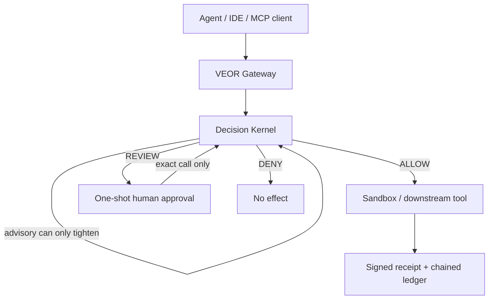

# VEOR

**A governed execution boundary for AI agents.** Models may propose tool calls; VEOR decides what may run, and records what did.

```text
Proposal → Reflex → Escalation → Authority → Effect → Proof
```



## The problem

Agent stacks often collapse judgment, permission, and side effects into one LLM call. That makes “the model said so” indistinguishable from “this was authorized,” and leaves little durable evidence when something goes wrong.

## What VEOR guarantees (in this preview)

When a call is routed through VEOR:

- **Deterministic policy first** — `ALLOW < REVIEW < DENY`; unknown MCP tools fail closed under the default bundle.
- **Monotonic advisory** — a reflex/advisory provider may only *tighten* via `max(severity, advisory)`. It cannot manufacture authority or weaken a deterministic `REVIEW`/`DENY`.
- **One-shot approvals** — human `REVIEW` → `ALLOW` is Ed25519-signed, bound to exact tool + argument digest + scope + expiry, and consumed once.
- **Receipts** — gateway decisions can emit a separately signed execution receipt (distinct key from approval authority), including non-executed `DENY`/`REVIEW` artefacts when receipt signing is configured.
- **Sandbox honesty** — `osEnforced: true` only after the platform backend actually starts the child. Linux uses Bubblewrap (plus seccomp when the filter loads). macOS uses Seatbelt (`sandbox-exec`) when that binary exists. Windows runs the effect and reports `osEnforced: false`.

## What VEOR does **not** guarantee

Read `docs/THREAT_MODEL.md` and `docs/SECURITY_MATRIX.md` before citing this project.

- Not a security certification or “production-safe” claim (`LAUNCH.md`, `SECURITY.md`).
- External security review: **PENDING** (`DEV_EVIDENCE.md`).
- Same-user bypass: an unrestricted shell outside the repo host hook can still bypass VEOR.
- Host sandbox: Linux Bubblewrap when `bwrap` starts; macOS Seatbelt when `sandbox-exec` starts; otherwise process-only, including Windows. No gVisor or microVM.
- MCP transport: hand-written stdio JSON-RPC adapter for testing; **not** advertised as complete MCP 2026-07-28 / official SDK v2 conformance.

**Status:** `0.4.0-dev.5` developer preview · MIT · Node.js ≥ 22 · Linux, macOS, and Windows.

## Install (≤2 commands)

```bash
git clone https://github.com/winterbim/veor.git && cd veor
npm run demo
```

No runtime packages to install beyond Node itself. Full gate: `npm run check` (61 tests).

## Live demo (not a mock)

```bash
npm run demo
npm run verify
```

Real offline verify output from this workspace (exit 0):

```text
{
  "ok": true,
  "kind": "veor.receipt-verify/v1",
  "checks": {
    "structure": true,
    "digest": true,
    "signature": true,
    "ledger": null
  },
  "reasons": [
    "OK"
  ],
  "digest": "ecf4fb63873b74bc9faa489ac603164011dec6be0137f9b3cc228870d37995f0",
  "receiptId": "4fd71d81-a411-4d9f-8564-7030ce3f999a"
}
```

What the signature covers, and what it does not, is spelled out in `docs/PROOF.md`.

## Self-dogfood — VEOR on VEOR

VEOR governs calls against this repository using `policies/veor-self.json` (ALLOW reads / secret probe; DENY destructive delete and writes).

```bash
npm run self
npm run verify:self
```

Real output from this workspace:

```text
## 1) ALLOW — read CONSTITUTION.md through gateway
{
  "executed": true,
  "decision": "ALLOW",
  "tool": "filesystem.read_file",
  "signaturePresent": true,
  "signatureValid": true
}

## 2) DENY — destructive veor.self.delete blocked before downstream
{
  "decision": "DENY",
  "executed": false,
  "reasons": [
    "MCP_SIDE_EFFECT_HINT",
    "POLICY_DENY"
  ],
  "signaturePresent": true,
  "signatureValid": true
}

## 3) ALLOW — secret_probe via broker-injected one-shot file
{
  "effectSawSecret": true,
  "secretLengthMatched": true,
  "receiptContainsSecret": false,
  "stderrContainsSecret": false,
  "signatureValid": true
}

## 4) Offline verify — ALLOW receipt replays; tamper fails
{
  "verifyAllow": { "ok": true, "digest": "682cb5e501c8d9452c970987606facf99cc64a3b15775daee61946cc9014e55c" },
  "verifyTampered": { "ok": false, "reasons": ["DIGEST_MISMATCH"] },
  "cliExitCode": 0
}
```

`npm run verify:self` replay (exit 0):

```text
{
  "ok": true,
  "kind": "veor.receipt-verify/v1",
  "checks": {
    "structure": true,
    "digest": true,
    "signature": true,
    "ledger": null
  },
  "reasons": [
    "OK"
  ],
  "digest": "682cb5e501c8d9452c970987606facf99cc64a3b15775daee61946cc9014e55c",
  "receiptId": "17a3daa4-cb60-4b0e-853c-f02dd38f9051"
}
```

## Why VEOR

| Fact | Why it matters |
|---|---|
| Monotonic `max(deterministic, advisory)` | Semantic risk can add friction; it cannot grant power. |
| One-shot, exact-call approvals | Replay and argument rebinding fail closed in the approval store. |
| Separate receipt authority | “Someone approved” ≠ “this effect’s evidence is authentic.” |
| Truthful `osEnforced` | Process fallback never masquerades as a sandbox; bwrap claims enforcement only after spawn. |
| Portable JSON policy, zero runtime deps | Inspectable authority surface; small install footprint. |

## MCP client config (what works today)

Entry point: **`src/mcp/stdio.js`**. Official MCP SDK v2 transport is still P0 work.

**Cursor** (shipped as `.cursor/mcp.json`):

```json
{
  "mcpServers": {
    "veor-self": {
      "type": "stdio",
      "command": "node",
      "args": ["${workspaceFolder}/src/mcp/stdio.js"],
      "env": {
        "VEOR_POLICY": "${workspaceFolder}/policies/veor-self.json",
        "VEOR_RUNTIME_DIR": "${workspaceFolder}/.veor/cursor-runtime",
        "VEOR_DOWNSTREAM_JSON": "[\"node\",\"${workspaceFolder}/examples/mcp/self-server.js\"]"
      }
    }
  }
}
```

Host hook (agent/npm gated surface): `.cursor/hooks.json` → `node .cursor/hooks/veor-repo-effect.js`. See `docs/THREAT_MODEL.md` for coverage vs same-user shell.

```bash
npx veor sandbox-info
# or: node src/cli.js sandbox-info
```

## Development

```bash
npm run check          # parse all surfaces + full test gate
npm run demo           # live gateway boundary demo (+ receipt artefact)
npm run verify         # offline Ed25519+digest check of demo receipt
npm run self           # VEOR-on-VEOR dogfood (+ ALLOW/DENY receipts)
npm run verify:self    # offline verify of self ALLOW receipt
```

Current gate: **61/61** tests.

## Docs worth reading before sharing claims

- `LAUNCH.md` — what not to market yet
- `SECURITY.md` / `docs/THREAT_MODEL.md` / `docs/SECURITY_MATRIX.md`
- `docs/PROOF.md` — what a signed receipt proves (and does not)
- `CURSOR_HANDOFF.md` — P0 before calling it beta

## License

MIT.
